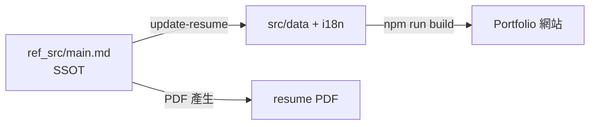
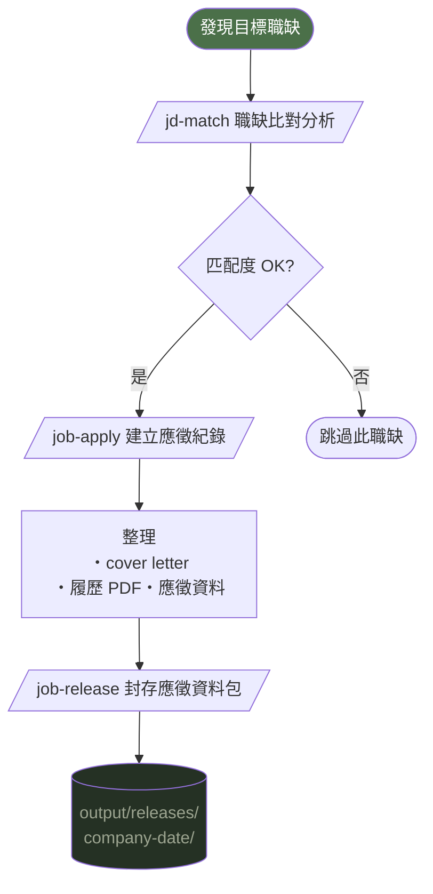

# SmartResume 🧑‍💼

> **AI 驅動的個人品牌工具包** — Portfolio 網站 + 履歷管理 + 求職流程自動化

**語系:** **🇹🇼 繁中** | [🇬🇧 English](./README.en.md)

🌐 **Live Demo:** [https://lewsi.ddns.net/smartresume/](https://lewsi.ddns.net/smartresume/)

給「懂用 AI」的人設計：不只是靜態網站，還有一整套 AI Skills，讓各種 AI agent 幫你維護履歷、分析職缺、產出求職信。

---

## ✨ 功能特色

- 🌐 **個人 Portfolio 網站** — Vue 3 + Tailwind CSS，暗色主題，中英雙語切換，typing 動畫
- 📋 **SSOT 履歷管理** — `ref_src/main.md` 為單一資料源，一次更新同步網站 + PDF
- 🎯 **JD 比對分析** — 自動比對職缺與你的履歷，輸出匹配度報告
- ✉️ **Cover Letter 自動產生** — 依 JD 客製化中英文求職信
- 📦 **求職流程管理** — 從分析職缺到封存完整應徵包一條龍
- 🎨 **主題客製化** — 從任何設計截圖萃取 color palette 套用到網站

---

## 📋 前置需求

| 項目 | 說明 |
|------|------|
| **Node.js** (v18+) | 建構網站與產生 PDF 所需。[下載 Node.js](https://nodejs.org/) |
| **npm** | 隨 Node.js 一起安裝 |
| **AI Agent** (至少一個) | 需要 AI Agent 來驅動 Skills。支援：[Claude Code](https://claude.ai/code)、[Gemini CLI](https://github.com/google-gemini/gemini-cli)、[OpenAI Codex](https://openai.com/codex)、或其他支援 Skill 讀取的 agent |

> Skills 是給 AI Agent 讀取的操作指引，沒有 AI Agent 就無法使用 `/update-resume`、`/jd-match` 等功能。手動操作仍可直接編輯 `ref_src/main.md` 和 `src/` 下的檔案。

---

## 🚀 快速開始

**Step 1：Fork 此 repo**

```bash
# Fork 後 clone 到本地
git clone git@github.com:<your-username>/SmartResume.git
cd SmartResume
npm install
```

**Step 2：用 AI agent 填入個人資料**

```
/update-resume
```

透過互動式 Q&A 填寫個人資訊，AI 自動同步至所有網站檔案並產生履歷 PDF。

**Step 3：部署上線**

```bash
npm run build
# 部署到 GitHub Pages / Vercel / VPS（見部署說明）
```

---

## 📖 使用情境

### 情境 1：建立個人 Portfolio 網站

適合：想快速建立有設計感的個人作品集頁面

```
/update-resume
```

1. AI 引導你逐段填入：基本資料、技能、專案、聯絡方式
2. 自動同步至 `src/data/` 和 `src/i18n/`
3. `npm run build` 建構網站，部署到你的伺服器

---

### 情境 2：更新履歷內容

適合：有新專案、新工作經驗要加入

```
/update-resume
```

- 只需修改 `ref_src/main.md`（單一來源）
- AI 自動偵測差異並同步所有相關檔案
- 同時重新產生中英文 PDF

**資料流向：**



---

### 情境 3：分析職缺 JD

適合：看到感興趣的職缺，想快速了解匹配度

```
/jd-match
```

提供 JD 方式（三選一）：
- 貼上職缺文字
- 提供職缺頁面網址
- 提供本地 JD 檔案路徑

輸出：
- `output/jd-analysis/{company}-{date}.md` — 匹配度分析報告
- `output/cover-letters/{company}-{date}.md` — 客製化求職信（中/英）

---

### 情境 4：針對不同公司客製化履歷

適合：同時應徵多家公司，每家需要不同面向的履歷

```
/jd-match → /job-apply
```

- 先用 `/jd-match` 分析職缺，產出匹配度報告與 Cover Letter
- 再用 `/job-apply` 根據分析結果，建立 `apply/{company}-{position}` 分支
- 客製化 Professional Summary、技能排序、經歷描述
- 同一份 SSOT，不同分支各自調整，互不影響
- 每個分支都有獨立的網站建置與 PDF，可同時維護多個版本

例如：應徵前端職缺強調 Vue/React 經驗，應徵全端職缺則突出系統架構能力。

---

### 情境 5：完整求職流程

適合：從發現職缺到送出應徵的完整自動化



---

### 情境 6：客製化網站主題

適合：想改變 Portfolio 網站的視覺風格

```
/theme-extractor
```

提供任意網站 URL 或設計截圖，AI 自動萃取 color palette（primary、secondary、accent、background），預覽配色效果後一鍵套用到整個 Portfolio 網站。支援 Tailwind CSS 變數與 dark mode 配色同步更新。

---

## 🤖 AI Skills 完整說明

### Skill 存放位置

所有 Skill 定義同時存放在兩個目錄，內容一致，讓不同 AI Agent 都能讀取：

| 目錄 | 適用 Agent |
|------|-----------|
| `.claude/skills/<name>/SKILL.md` | Claude Code |
| `.agent/skills/<name>/SKILL.md` | Codex、Gemini CLI、其他通用 Agent |

### Skills 清單

| Skill | 指令 | 功能 |
|-------|------|------|
| `update-resume` | `/update-resume` | 互動式履歷更新，SSOT 同步網站檔案與 PDF |
| `jd-match` | `/jd-match` | JD 比對分析 + 客製化 Cover Letter |
| `job-apply` | `/job-apply` | 建立 `apply/*` 分支，針對目標職缺客製化履歷與網站 |
| `job-release` | `/job-release` | 封存完整應徵資料包（PDF、JD 分析、Cover Letter、網站建置） |
| `theme-extractor` | `/theme-extractor` | 從網站 URL 或截圖萃取 color palette 並套用到網站 |

> 專案另含通用工具類 skill（`pdf`、`docx`、`canvas-design`、`frontend-design`、`theme-factory`、`playwright-skill`），存放於同一目錄下。

---

## 📁 專案結構

```
SmartResume/
├── src/                    # Vue 3 前端原始碼
│   ├── components/         # 版面與頁面區塊元件
│   ├── composables/        # 主題、語系、typing 動畫
│   ├── i18n/               # 繁中 / 英文翻譯
│   ├── data/               # 專案、技能、技術棧、統計資料
│   └── types/              # TypeScript 型別定義
├── ref_src/                # 履歷資料（SSOT）
│   ├── main.md             # ⭐ 單一資料源，所有履歷內容從此同步
│   ├── resume_zh.md        # 中文履歷 Markdown（PDF 來源）
│   └── resume_en.md        # 英文履歷 Markdown（PDF 來源）
├── public/                 # 靜態資源
│   ├── resume_zh.pdf       # 中文履歷 PDF
│   └── resume_en.pdf       # 英文履歷 PDF
├── output/                 # AI Skills 輸出
│   ├── jd-analysis/        # JD 比對分析報告
│   ├── cover-letters/      # 客製化求職信
│   └── releases/           # 封存的應徵資料包（由 /job-release 產出並 commit）
├── .claude/skills/         # Skill 定義（Claude Code 讀取）
├── .agent/skills/          # Skill 定義（通用 Agent 讀取，與 .claude/ 同步）
├── docs/                   # 設計規格文件
└── specs/                  # 開發任務 walkthrough
```

---

## 🛠 Tech Stack

| 層級 | 技術 |
|------|------|
| 前端框架 | Vue 3 + Composition API + `<script setup>` |
| 樣式 | Tailwind CSS（dark mode class 策略） |
| 語系 | vue-i18n（繁中 / 英） |
| 建構工具 | Vite + TypeScript |
| AI Skills | Claude Code / 通用 Agent / Gemini CLI |

---

## 🌐 部署

**本地預覽**

```bash
npm install
npm run dev
```

**建構網站**

```bash
npm run build   # TypeScript 型別檢查 + Vite 建構
npm run preview # 預覽建構結果
```

建構產出在 `dist/` 目錄，可部署到 GitHub Pages、Vercel、Netlify、Cloudflare Pages 或自有 VPS。各平台的步驟整理於 [docs/deploy-options.md](docs/deploy-options.md)（推薦 fork 使用者先看這份）。

**部署到自有 VPS（subpath）**

兩種方式擇一（皆於 [docs/deployment.md](docs/deployment.md) 完整說明）：

- **GitHub Actions：** 內建 `.github/workflows/deploy.yml`（手動觸發），SSH key 放 GitHub Secrets
- **本機 build + rsync：** `npm run deploy`（讀 `.env.local`），不依賴 CI、本機直接推送

若部署到 subpath（例如 `/smartresume/`），build 時需帶 `VITE_BASE` 環境變數：

```bash
VITE_BASE=/smartresume/ npm run build
```

---

## 🔐 環境變數

在專案根目錄建立 `.env.local`（已被 `.gitignore` 排除）來設定選用變數：

```bash
# Google Analytics（選用）— 未設定則 GA 腳本不會注入
VITE_GA_ID=G-XXXXXXXXXX

# Contact form Formspree ID（選用）— 未設定則表單送出會顯示錯誤提示
VITE_FORMSPREE_ID=xxxxxxxx
```

| 變數 | 必填 | 用途 |
|------|------|------|
| `VITE_GA_ID` | 否 | Google Analytics 4 追蹤 ID（格式 `G-XXXXXXXXXX`）。由 [src/analytics.ts](src/analytics.ts) 在執行時讀取，若未設定則完全略過注入 `gtag.js`。 |
| `VITE_FORMSPREE_ID` | 否 | [Formspree](https://formspree.io) 表單 ID（取自 form URL `formspree.io/f/<id>` 的 `<id>` 部分）。未設定時 [ContactSection.vue](src/components/sections/ContactSection.vue) 的送出動作會顯示錯誤，提示使用者改寄 Email。 |
| `VITE_BASE` | 否 | **Build 時使用。** [vite.config.ts](vite.config.ts) 讀取此變數設定 Vite 的 `base`（subpath 部署時必填，例如 `/smartresume/`）。未設時預設 `/`。範例：`VITE_BASE=/smartresume/ npm run build`。 |
