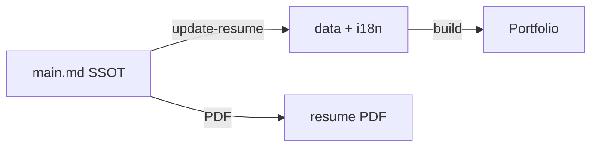
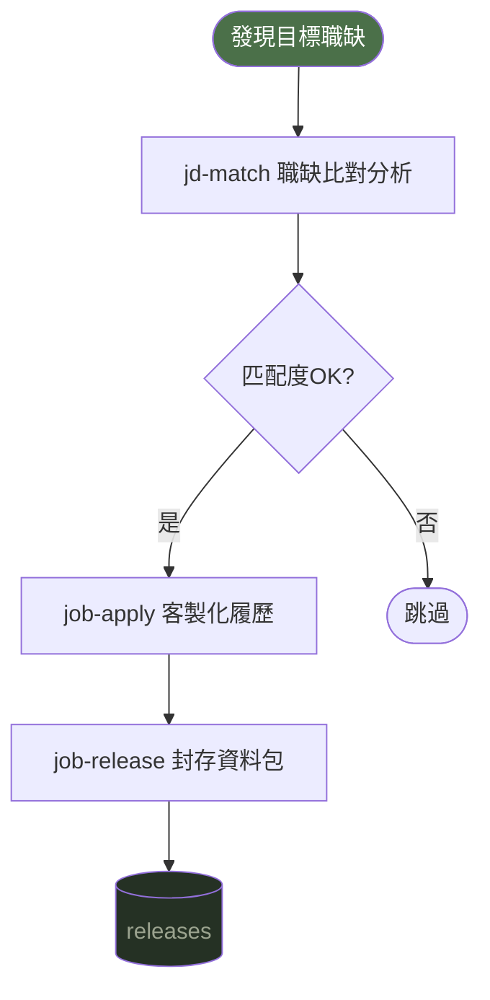

# SmartResume 🧑‍💼

> **AI 驅動的個人品牌工具包** — Portfolio 網站 + 履歷管理 + 求職流程自動化
>
> **AI-powered personal branding toolkit** — Portfolio website + Resume management + Job application automation

給「懂用 AI」的人設計：不只是靜態網站，還有一整套 AI Skills，讓各種 AI agent 幫你維護履歷、分析職缺、產出求職信。

Designed for AI-fluent users: not just a static site, but a full suite of AI Skills that let any AI agent maintain your resume, analyze job listings, and generate cover letters.

[中文說明](#-中文說明) | [English Guide](#-english-guide)

---

## 🇹🇼 中文說明

### ✨ 功能特色

- 🌐 **個人 Portfolio 網站** — Vue 3 + Tailwind CSS，暗色主題，中英雙語切換，typing 動畫
- 📋 **SSOT 履歷管理** — `ref_src/main.md` 為單一資料源，一次更新同步網站 + PDF
- 🎯 **JD 比對分析** — 自動比對職缺與你的履歷，輸出匹配度報告
- ✉️ **Cover Letter 自動產生** — 依 JD 客製化中英文求職信
- 📦 **求職流程管理** — 從分析職缺到封存完整應徵包一條龍
- 🎨 **主題客製化** — 從任何設計截圖萃取 color palette 套用到網站

---

### 📋 前置需求

| 項目 | 說明 |
|------|------|
| **Node.js** (v18+) | 建構網站與產生 PDF 所需。[下載 Node.js](https://nodejs.org/) |
| **npm** | 隨 Node.js 一起安裝 |
| **AI Agent** (至少一個) | 需要 AI Agent 來驅動 Skills。支援：[Claude Code](https://claude.ai/code)、[Gemini CLI](https://github.com/google-gemini/gemini-cli)、[OpenAI Codex](https://openai.com/codex)、或其他支援 Skill 讀取的 agent |

> Skills 是給 AI Agent 讀取的操作指引，沒有 AI Agent 就無法使用 `/update-resume`、`/jd-match` 等功能。手動操作仍可直接編輯 `ref_src/main.md` 和 `src/` 下的檔案。

---

### 🚀 快速開始

**Step 1：Fork 此 repo**

```bash
# Fork 後 clone 到本地
git clone git@github.com:Lewsifat/SmartResume.git
cd SmartResume
npm install
```

**Step 2：用 AI agent 填入個人資料**

```
/update-resume
```

透過互動式 Q&A 填寫個人資訊，AI 自動同步至所有網站檔案並產生履歷 PDF。

**Step 3：部署上線**

```bash
npm run build
# 部署到 GitHub Pages / Vercel / VPS（見部署說明）
```

---

### 📖 使用情境

#### 情境 1：建立個人 Portfolio 網站

適合：想快速建立有設計感的個人作品集頁面

```
/update-resume
```

1. AI 引導你逐段填入：基本資料、技能、專案、聯絡方式
2. 自動同步至 `src/data/` 和 `src/i18n/`
3. `npm run build` 建構網站，部署到你的伺服器

---

#### 情境 2：更新履歷內容

適合：有新專案、新工作經驗要加入

```
/update-resume
```

- 只需修改 `ref_src/main.md`（單一來源）
- AI 自動偵測差異並同步所有相關檔案
- 同時重新產生中英文 PDF

**資料流向：**



---

#### 情境 3：分析職缺 JD

適合：看到感興趣的職缺，想快速了解匹配度

```
/jd-match
```

提供 JD 方式（三選一）：
- 貼上職缺文字
- 提供職缺頁面網址
- 提供本地 JD 檔案路徑

輸出：
- `output/jd-analysis/{company}-{date}.md` — 匹配度分析報告
- `output/cover-letters/{company}-{date}.md` — 客製化求職信（中/英）

---

#### 情境 4：針對不同公司客製化履歷

適合：同時應徵多家公司，每家需要不同面向的履歷

```
/jd-match → /job-apply
```

- 先用 `/jd-match` 分析職缺，產出匹配度報告與 Cover Letter
- 再用 `/job-apply` 根據分析結果，建立 `apply/{company}-{position}` 分支
- 客製化 Professional Summary、技能排序、經歷描述
- 同一份 SSOT，不同分支各自調整，互不影響
- 每個分支都有獨立的網站建置與 PDF，可同時維護多個版本

例如：應徵前端職缺強調 Vue/React 經驗，應徵全端職缺則突出系統架構能力。

---

#### 情境 5：完整求職流程

適合：從發現職缺到送出應徵的完整自動化



---

#### 情境 6：客製化網站主題

適合：想改變 Portfolio 網站的視覺風格

```
/theme-extractor
```

提供任意網站 URL 或設計截圖，AI 自動萃取 color palette（primary、secondary、accent、background），預覽配色效果後一鍵套用到整個 Portfolio 網站。支援 Tailwind CSS 變數與 dark mode 配色同步更新。

---

### 🤖 AI Skills 完整說明

#### Skill 存放位置

所有 Skill 定義同時存放在兩個目錄，內容一致，讓不同 AI Agent 都能讀取：

| 目錄 | 適用 Agent |
|------|-----------|
| `.claude/skills/<name>/SKILL.md` | Claude Code |
| `.agent/skills/<name>/SKILL.md` | Codex、Gemini CLI、其他通用 Agent |

#### Skills 清單

| Skill | 指令 | 功能 |
|-------|------|------|
| `update-resume` | `/update-resume` | 互動式履歷更新，SSOT 同步網站檔案與 PDF |
| `jd-match` | `/jd-match` | JD 比對分析 + 客製化 Cover Letter |
| `job-apply` | `/job-apply` | 建立 `apply/*` 分支，針對目標職缺客製化履歷與網站 |
| `job-release` | `/job-release` | 封存完整應徵資料包（PDF、JD 分析、Cover Letter、網站建置） |
| `theme-extractor` | `/theme-extractor` | 從網站 URL 或截圖萃取 color palette 並套用到網站 |

> 專案另含通用工具類 skill（`pdf`、`docx`、`canvas-design`、`frontend-design`、`theme-factory`、`playwright-skill`），存放於同一目錄下。

---

### 📁 專案結構

```
SmartResume/
├── src/                    # Vue 3 前端原始碼
│   ├── components/         # 版面與頁面區塊元件
│   ├── composables/        # 主題、語系、typing 動畫
│   ├── i18n/               # 繁中 / 英文翻譯
│   ├── data/               # 專案、技能、技術棧、統計資料
│   └── types/              # TypeScript 型別定義
├── ref_src/                # 履歷資料（SSOT）
│   ├── main.md             # ⭐ 單一資料源，所有履歷內容從此同步
│   ├── resume_zh.md        # 中文履歷 Markdown（PDF 來源）
│   └── resume_en.md        # 英文履歷 Markdown（PDF 來源）
├── public/                 # 靜態資源
│   ├── resume_zh.pdf       # 中文履歷 PDF
│   └── resume_en.pdf       # 英文履歷 PDF
├── output/                 # AI Skills 輸出
│   ├── jd-analysis/        # JD 比對分析報告
│   ├── cover-letters/      # 客製化求職信
│   └── releases/           # 封存的應徵資料包（由 /job-release 產出並 commit）
├── .claude/skills/         # Skill 定義（Claude Code 讀取）
├── .agent/skills/          # Skill 定義（通用 Agent 讀取，與 .claude/ 同步）
├── docs/                   # 設計規格文件
└── specs/                  # 開發任務 walkthrough
```

---

### 🛠 Tech Stack

| 層級 | 技術 |
|------|------|
| 前端框架 | Vue 3 + Composition API + `<script setup>` |
| 樣式 | Tailwind CSS（dark mode class 策略） |
| 語系 | vue-i18n（繁中 / 英） |
| 建構工具 | Vite + TypeScript |
| AI Skills | Claude Code / 通用 Agent / Gemini CLI |

---

### 🌐 部署

**本地預覽**

```bash
npm install
npm run dev
```

**建構網站**

```bash
npm run build   # TypeScript 型別檢查 + Vite 建構
npm run preview # 預覽建構結果
```

建構產出在 `dist/` 目錄，可部署到 GitHub Pages、Vercel、Netlify 或自有 VPS。

---

## 🇬🇧 English Guide

### ✨ Features

- 🌐 **Portfolio Website** — Vue 3 + Tailwind CSS, dark theme, bilingual (zh-TW / EN), typing animation
- 📋 **SSOT Resume Management** — `ref_src/main.md` as single source of truth, sync to website + PDF in one step
- 🎯 **JD Match Analysis** — Auto-compare job descriptions against your resume with match scoring
- ✉️ **Cover Letter Generation** — Customized cover letters (Chinese + English) based on JD analysis
- 📦 **Job Application Workflow** — End-to-end: analyze → apply → archive
- 🎨 **Theme Customization** — Extract color palettes from any design reference

---

### 📋 Prerequisites

| Requirement | Details |
|-------------|---------|
| **Node.js** (v18+) | Required to build the website and generate PDFs. [Download Node.js](https://nodejs.org/) |
| **npm** | Included with Node.js |
| **AI Agent** (at least one) | Required to run Skills. Supported: [Claude Code](https://claude.ai/code), [Gemini CLI](https://github.com/google-gemini/gemini-cli), [OpenAI Codex](https://openai.com/codex), or any agent that reads skill definitions |

> Skills are instruction files read by AI Agents. Without an AI Agent, commands like `/update-resume` and `/jd-match` won't work. You can still manually edit `ref_src/main.md` and `src/` files.

---

### 🚀 Quick Start

**Step 1: Fork this repo**

```bash
git clone git@github.com:Lewsifat/SmartResume.git
cd SmartResume && npm install
```

**Step 2: Fill in your data with an AI agent**

```
/update-resume
```

Interactive Q&A — AI syncs everything to website files and generates resume PDFs automatically.

**Step 3: Deploy**

```bash
npm run build
```

---

### 📖 Use Cases

#### Use Case 1: Build Your Portfolio

```
/update-resume
```

Guided setup → auto-syncs to `src/data/` and `src/i18n/` → `npm run build` to deploy.

#### Use Case 2: Update Resume Content

Edit `ref_src/main.md` → run `/update-resume` → AI detects diffs and syncs all related files + regenerates PDFs.

#### Use Case 3: Analyze a Job Description

```
/jd-match
```

Provide JD via text, URL, or file path → get match analysis + custom cover letter saved to `output/`.

#### Use Case 4: Tailor Resume for Different Companies

```
/jd-match → /job-apply
```

Start with `/jd-match` to analyze the job description and generate a match report + cover letter. Then use `/job-apply` to create an `apply/{company}-{position}` branch with customized resume, website build, and PDFs. Apply for a frontend role emphasizing Vue/React, or a full-stack role highlighting system architecture — all from the same SSOT, on separate branches.

#### Use Case 5: Full Job Application Workflow

```
/jd-match → /job-apply → /job-release
```

From finding a job listing to archiving a complete application package.

#### Use Case 6: Customize Website Theme

```
/theme-extractor
```

Provide any website URL or design screenshot. AI extracts the color palette (primary, secondary, accent, background), previews it, and applies it to your entire Portfolio site — including Tailwind CSS variables and dark mode colors.

---

### 🤖 AI Skills — Where They Live

All skills are stored in two directories with identical content, so different AI agents can read them:

| Directory | Used by |
|-----------|---------|
| `.claude/skills/<name>/SKILL.md` | Claude Code |
| `.agent/skills/<name>/SKILL.md` | Codex, Gemini CLI, other agents |

#### Skills List

| Skill | Command | Description |
|-------|---------|-------------|
| `update-resume` | `/update-resume` | Interactive resume update, SSOT sync to website + PDF |
| `jd-match` | `/jd-match` | JD match analysis + customized cover letter generation |
| `job-apply` | `/job-apply` | Create `apply/*` branch, customize resume and website for a target job |
| `job-release` | `/job-release` | Archive complete application package (PDF, JD analysis, cover letter, website build) |
| `theme-extractor` | `/theme-extractor` | Extract color palette from URL or screenshot and apply to website |

> The project also includes general-purpose utility skills (`pdf`, `docx`, `canvas-design`, `frontend-design`, `theme-factory`, `playwright-skill`) in the same directories.

---

### 📁 Project Structure

```
SmartResume/
├── src/                    # Vue 3 frontend source
├── ref_src/                # Resume data (SSOT)
│   └── main.md             # ⭐ Single source of truth
├── public/                 # resume_zh.pdf, resume_en.pdf
├── output/                 # AI Skills output
│   ├── jd-analysis/        # JD match reports
│   ├── cover-letters/      # Generated cover letters
│   └── releases/           # Archived application packages (committed by /job-release)
├── .claude/skills/         # Skill definitions (read by Claude Code)
└── .agent/skills/          # Skill definitions (read by other agents, synced with .claude/)
```

---

### 🛠 Tech Stack

| Layer | Tech |
|-------|------|
| Framework | Vue 3 + Composition API |
| Styling | Tailwind CSS (dark mode) |
| i18n | vue-i18n (zh-TW / EN) |
| Build | Vite + TypeScript |
| AI Skills | Claude Code / General Agent / Gemini CLI |
