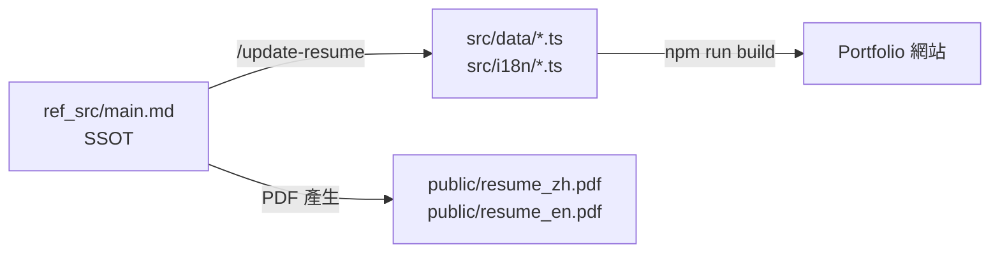

# SmartResume 🧑‍💼

> **AI 驅動的個人品牌工具包** — Portfolio 網站 + 履歷管理 + 求職流程自動化
>
> **AI-powered personal branding toolkit** — Portfolio website + Resume management + Job application automation

給「懂用 AI」的人設計：不只是靜態網站，還有一整套 AI Skills，讓各種 AI agent 幫你維護履歷、分析職缺、產出求職信。

Designed for AI-fluent users: not just a static site, but a full suite of AI Skills that let any AI agent maintain your resume, analyze job listings, and generate cover letters.

[中文說明](#-中文說明) | [English Guide](#-english-guide)

---

## 🇹🇼 中文說明

### ✨ 功能特色

- 🌐 **個人 Portfolio 網站** — Vue 3 + Tailwind CSS，暗色主題，中英雙語切換，typing 動畫
- 📋 **SSOT 履歷管理** — `ref_src/main.md` 為單一資料源，一次更新同步網站 + PDF
- 🎯 **JD 比對分析** — 自動比對職缺與你的履歷，輸出匹配度報告
- ✉️ **Cover Letter 自動產生** — 依 JD 客製化中英文求職信
- 📦 **求職流程管理** — 從分析職缺到封存完整應徵包一條龍
- 🎨 **主題客製化** — 從任何設計截圖萃取 color palette 套用到網站

---

### 🚀 快速開始

**Step 1：Fork 此 repo**

```bash
# Fork 後 clone 到本地
git clone https://github.com/YOUR_USERNAME/SmartResume.git
cd SmartResume
npm install
```

**Step 2：用 AI agent 填入個人資料**

```
/update-resume
```

透過互動式 Q&A 填寫個人資訊，AI 自動同步至所有網站檔案並產生履歷 PDF。

**Step 3：部署上線**

```bash
npm run build
# 部署到 GitHub Pages / Vercel / VPS（見部署說明）
```

---

### 📖 使用情境

#### 情境 1：建立個人 Portfolio 網站

適合：想快速建立有設計感的個人作品集頁面

```
/update-resume
```

1. AI 引導你逐段填入：基本資料、技能、專案、聯絡方式
2. 自動同步至 `src/data/` 和 `src/i18n/`
3. Push → GitHub Actions 自動部署

---

#### 情境 2：更新履歷內容

適合：有新專案、新工作經驗要加入

```
/update-resume
```

- 只需修改 `ref_src/main.md`（單一來源）
- AI 自動偵測差異並同步所有相關檔案
- 同時重新產生中英文 PDF

**資料流向：**



---

#### 情境 3：分析職缺 JD

適合：看到感興趣的職缺，想快速了解匹配度

```
/jd-match
```

提供 JD 方式（三選一）：
- 貼上職缺文字
- 提供職缺頁面網址
- 提供本地 JD 檔案路徑

輸出：
- `output/jd-analysis/{company}-{date}.md` — 匹配度分析報告
- `output/cover-letters/{company}-{date}.md` — 客製化求職信（中/英）

---

#### 情境 4：完整求職流程

適合：從發現職缺到送出應徵的完整自動化

```mermaid
flowchart TD
    A([發現目標職缺]) --> B[/jd-match\n職缺比對分析]
    B --> C{匹配度 OK?}
    C -->|是| D[/job-apply\n建立應徵紀錄]
    C -->|否| E([跳過此職缺])
    D --> F[整理\n・cover letter\n・履歷 PDF\n・應徵資料]
    F --> G[/job-release\n封存應徵資料包]
    G --> H[(output/releases/\ncompany-date/)]

    style A fill:#4b7049,color:#fff
    style H fill:#253124,color:#9ba38f
```

---

#### 情境 5：客製化網站主題

適合：想改變 Portfolio 網站的視覺風格

```
/theme-factory    # 從頭設計新主題
/theme-extractor  # 從截圖/設計稿萃取 color palette
```

---

### 🤖 AI Skills 完整說明

#### Skill 讀取位置對照

不同 AI agent 會從不同路徑讀取 Skill 定義：

| AI Agent | Skill 目錄 | 設定檔 |
|----------|-----------|--------|
| **Claude Code** | `.claude/skills/<name>/SKILL.md` | `.claude/settings.json` |
| **通用 Agent** | `.agent/skills/<name>/SKILL.md` | `.agent/settings.local.json` |
| **Gemini CLI** | `.gemini/skills/<name>/SKILL.md` | — |

> 同一個 Skill 功能可以在不同目錄下各自實作，讓不同 AI 都能使用。

#### Skills 清單

**Claude Code 專屬 (`.claude/skills/`)**

| Skill | 指令 | 功能 |
|-------|------|------|
| `update-resume` | `/update-resume` | 互動式履歷更新，SSOT 同步網站與 PDF |
| `jd-match` | `/jd-match` | JD 比對分析 + 客製化 Cover Letter |
| `job-apply` | `/job-apply` | 建立應徵紀錄，整理應徵資料 |
| `job-release` | `/job-release` | 封存完整應徵資料包 |
| `theme-extractor` | `/theme-extractor` | 從設計萃取主題色彩 |

**通用 Agent (`.agent/skills/`)**

| Skill | 功能 |
|-------|------|
| `theme-factory` | 從頭設計並套用新主題 |
| `frontend-design` | 產生高品質前端 UI 元件 |
| `deploy` | 部署至 VPS |
| `agent-browser` | 網頁瀏覽與資料擷取 |
| `skill-creator` | 建立新 Skill |
| `webapp-testing` | 網站功能測試 |
| `repo-sync` | 同步 repo 資訊 |

**Gemini CLI (`.gemini/skills/`)**

| Skill | 功能 |
|-------|------|
| `project-info-manager` | 管理專案資訊 |
| `repo-sync` | Repo 內容同步 |

---

### 📁 專案結構

```
SmartResume/
├── src/                    # Vue 3 前端原始碼
│   ├── components/         # 版面與頁面區塊元件
│   ├── composables/        # 主題、語系、typing 動畫
│   ├── i18n/               # 繁中 / 英文翻譯
│   ├── data/               # 專案、技能、技術棧、統計資料
│   └── types/              # TypeScript 型別定義
├── ref_src/                # 履歷資料（SSOT）
│   ├── main.md             # ⭐ 單一資料源，所有履歷內容從此同步
│   ├── resume_zh.md        # 中文履歷 Markdown（PDF 來源）
│   └── resume_en.md        # 英文履歷 Markdown（PDF 來源）
├── public/                 # 靜態資源
│   ├── resume_zh.pdf       # 中文履歷 PDF
│   └── resume_en.pdf       # 英文履歷 PDF
├── output/                 # AI Skills 輸出（gitignored）
│   ├── jd-analysis/        # JD 比對分析報告
│   ├── cover-letters/      # 客製化求職信
│   └── releases/           # 封存的應徵資料包
├── .claude/skills/         # Claude Code Skill 定義
├── .agent/skills/          # 通用 Agent Skill 定義
├── .gemini/skills/         # Gemini CLI Skill 定義
├── docs/                   # 設計規格文件
└── specs/                  # 開發任務 walkthrough
```

---

### 🛠 Tech Stack

| 層級 | 技術 |
|------|------|
| 前端框架 | Vue 3 + Composition API + `<script setup>` |
| 樣式 | Tailwind CSS（dark mode class 策略） |
| 語系 | vue-i18n（繁中 / 英） |
| 建構工具 | Vite + TypeScript |
| AI Skills | Claude Code / 通用 Agent / Gemini CLI |

---

### 🌐 部署

**本地預覽**

```bash
npm install
npm run dev
```

**建構**

```bash
npm run build   # TypeScript 型別檢查 + Vite 建構
npm run preview # 預覽建構結果
```

**自動部署（GitHub Actions）**

Push 到 `master` 分支後，`.github/workflows/deploy.yml` 自動觸發部署。

---

### 🔐 環境變數

在專案根目錄建立 `.env.local`（已被 `.gitignore` 排除）來設定選用變數：

```bash
# Google Analytics（選用）— 未設定則 GA 腳本不會注入
VITE_GA_ID=G-XXXXXXXXXX

# Contact form Formspree ID（選用）— 未設定則表單送出會顯示錯誤提示
VITE_FORMSPREE_ID=xxxxxxxx
```

| 變數 | 必填 | 用途 |
|------|------|------|
| `VITE_GA_ID` | 否 | Google Analytics 4 追蹤 ID（格式 `G-XXXXXXXXXX`）。由 [src/analytics.ts](src/analytics.ts) 在執行時讀取，若未設定則完全略過注入 `gtag.js`。 |
| `VITE_FORMSPREE_ID` | 否 | [Formspree](https://formspree.io) 表單 ID（取自 form URL `formspree.io/f/<id>` 的 `<id>` 部分）。未設定時 [ContactSection.vue](src/components/sections/ContactSection.vue) 的送出動作會顯示錯誤，提示使用者改寄 Email。 |

---

## 🇬🇧 English Guide

### ✨ Features

- 🌐 **Portfolio Website** — Vue 3 + Tailwind CSS, dark theme, bilingual (zh-TW / EN), typing animation
- 📋 **SSOT Resume Management** — `ref_src/main.md` as single source of truth, sync to website + PDF in one step
- 🎯 **JD Match Analysis** — Auto-compare job descriptions against your resume with match scoring
- ✉️ **Cover Letter Generation** — Customized cover letters (Chinese + English) based on JD analysis
- 📦 **Job Application Workflow** — End-to-end: analyze → apply → archive
- 🎨 **Theme Customization** — Extract color palettes from any design reference

---

### 🚀 Quick Start

**Step 1: Fork this repo**

```bash
git clone https://github.com/YOUR_USERNAME/SmartResume.git
cd SmartResume && npm install
```

**Step 2: Fill in your data with an AI agent**

```
/update-resume
```

Interactive Q&A — AI syncs everything to website files and generates resume PDFs automatically.

**Step 3: Deploy**

```bash
npm run build
```

---

### 📖 Use Cases

#### Use Case 1: Build Your Portfolio

```
/update-resume
```

Guided setup → auto-syncs to `src/data/` and `src/i18n/` → push to deploy.

#### Use Case 2: Update Resume Content

Edit `ref_src/main.md` → run `/update-resume` → AI detects diffs and syncs all related files + regenerates PDFs.

#### Use Case 3: Analyze a Job Description

```
/jd-match
```

Provide JD via text, URL, or file path → get match analysis + custom cover letter saved to `output/`.

#### Use Case 4: Full Job Application Workflow

```
/jd-match → /job-apply → /job-release
```

From finding a job listing to archiving a complete application package.

#### Use Case 5: Customize Website Theme

```
/theme-factory     # Design a new theme from scratch
/theme-extractor   # Extract palette from a design reference
```

---

### 🤖 AI Skills — Agent Reading Locations

Different AI agents read skills from different directories:

| AI Agent | Skill Directory | Config |
|----------|----------------|--------|
| **Claude Code** | `.claude/skills/<name>/SKILL.md` | `.claude/settings.json` |
| **General Agent** | `.agent/skills/<name>/SKILL.md` | `.agent/settings.local.json` |
| **Gemini CLI** | `.gemini/skills/<name>/SKILL.md` | — |

Each agent type can have its own implementation of the same skill concept, or unique skills suited to its capabilities.

**Claude Code Skills (`.claude/skills/`)**

| Skill | Command | Description |
|-------|---------|-------------|
| `update-resume` | `/update-resume` | Interactive resume update, SSOT sync to website + PDF |
| `jd-match` | `/jd-match` | JD analysis + customized cover letter generation |
| `job-apply` | `/job-apply` | Create application record, organize materials |
| `job-release` | `/job-release` | Archive complete application package |
| `theme-extractor` | `/theme-extractor` | Extract theme colors from design references |

**General Agent Skills (`.agent/skills/`)**

| Skill | Description |
|-------|-------------|
| `theme-factory` | Design and apply new themes from scratch |
| `frontend-design` | Generate high-quality frontend UI components |
| `deploy` | Deploy to VPS |
| `agent-browser` | Web browsing and data extraction |
| `skill-creator` | Create new skills |
| `webapp-testing` | Website functional testing |

**Gemini CLI Skills (`.gemini/skills/`)**

| Skill | Description |
|-------|-------------|
| `project-info-manager` | Manage project information |
| `repo-sync` | Sync repository content |

---

### 📁 Project Structure

```
SmartResume/
├── src/                    # Vue 3 frontend source
├── ref_src/                # Resume data (SSOT)
│   └── main.md             # ⭐ Single source of truth
├── public/                 # resume_zh.pdf, resume_en.pdf
├── output/                 # AI Skills output (gitignored)
│   ├── jd-analysis/        # JD match reports
│   ├── cover-letters/      # Generated cover letters
│   └── releases/           # Archived application packages
├── .claude/skills/         # Claude Code skill definitions
├── .agent/skills/          # General agent skill definitions
└── .gemini/skills/         # Gemini CLI skill definitions
```

---

### 🛠 Tech Stack

| Layer | Tech |
|-------|------|
| Framework | Vue 3 + Composition API |
| Styling | Tailwind CSS (dark mode) |
| i18n | vue-i18n (zh-TW / EN) |
| Build | Vite + TypeScript |
| AI Skills | Claude Code / General Agent / Gemini CLI |

---

### 🔐 Environment Variables

Create `.env.local` at the project root (gitignored) for optional config:

```bash
# Google Analytics (optional) — gtag.js is skipped entirely when unset
VITE_GA_ID=G-XXXXXXXXXX

# Contact form Formspree ID (optional) — form shows an error toast when unset
VITE_FORMSPREE_ID=xxxxxxxx
```

| Variable | Required | Purpose |
|----------|----------|---------|
| `VITE_GA_ID` | No | Google Analytics 4 measurement ID (`G-XXXXXXXXXX`). Read at runtime by [src/analytics.ts](src/analytics.ts); when unset the gtag script is not injected at all. |
| `VITE_FORMSPREE_ID` | No | [Formspree](https://formspree.io) form ID — the `<id>` part of `formspree.io/f/<id>`. When unset [ContactSection.vue](src/components/sections/ContactSection.vue) gracefully shows an error prompting users to email you directly. |
